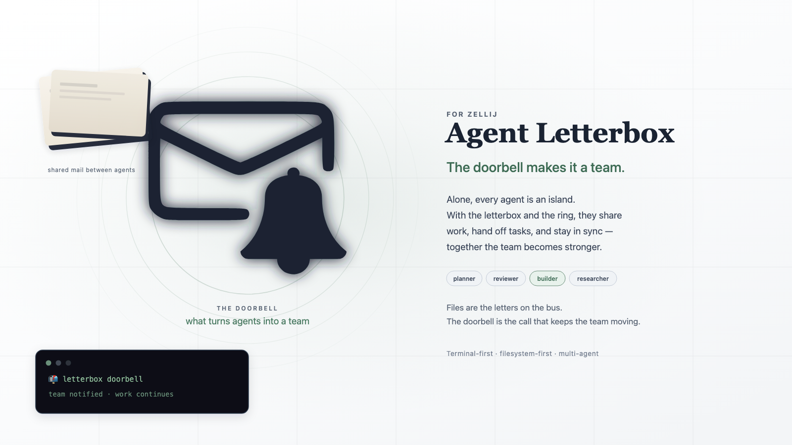

# Agent Letterbox for Zellij

## Ring the bell. Create the team.



**Agent Letterbox for Zellij turns separate coding-agent terminals into a live team inside [Zellij](https://zellij.dev).**

A message is saved safely on disk. When the recipient is live, Zellij receives one short instruction in its pane:

```text
📬 letterbox doorbell: unacked delegate in <letterbox>/<agent>/inbox/ — please check
```

The agent checks the durable message, replies, and hands work onward.

> **The doorbell makes it a team.**

## What you need

- Bash, Git, and **Zellij 0.44+** (`zellij --version`)
- A running local Zellij session
- Agents you already run in terminals (any coding-agent CLI you already use)

No servers beyond Zellij’s local multiplexer. No SSH/remote transport, plugins marketplace, desktop apps, webhooks, cmux, or tmux.

## Install

### Option A — Recommended: copy/paste installer

```bash
curl -fsSL https://raw.githubusercontent.com/SimonMallas/agent-letterbox-zellij/main/install.sh | sh
export PATH="$HOME/.local/bin:$PATH"
letterbox zellij setup --agents planner,reviewer,builder,researcher --automatic-doorbells
source "$HOME/.agent-letterbox/env.sh"
```

### Option B — Manual Git install

```bash
git clone https://github.com/SimonMallas/agent-letterbox-zellij.git \
  ~/Developer/agent-letterbox-zellij
cd ~/Developer/agent-letterbox-zellij
chmod +x bin/letterbox adapters/*.sh tests/*.sh
export PATH="$PWD/bin:$PATH"
letterbox zellij setup --agents planner,reviewer,builder,researcher --automatic-doorbells
source "$HOME/.agent-letterbox/env.sh"
```

Check:

```bash
letterbox --version
zellij --version
echo "$LETTERBOX_DIR"
```

## Launch agents (you choose the panes)

Open Zellij and arrange agents however the task requires. In **each agent pane**:

```bash
source "$HOME/.agent-letterbox/env.sh"

letterbox zellij run planner -- <your-agent-cli>
# other panes:
letterbox zellij run reviewer -- <your-agent-cli>
letterbox zellij run builder -- <your-agent-cli>
letterbox zellij run researcher -- <your-agent-cli>
```

`zellij run` registers the current `ZELLIJ_PANE_ID` **and** `ZELLIJ_SESSION_NAME` for live doorbells, then starts the command.

If a pane was rebuilt:

```bash
letterbox zellij register planner
letterbox zellij status
```

## Send a live handoff

```bash
source "$HOME/.agent-letterbox/env.sh"
export LETTERBOX_AGENT=planner

printf '%s\n' 'Review src/auth.ts and report correctness findings.' |
  letterbox send reviewer delegate auth-review --ack --now
```

1. Letter lands in the reviewer’s inbox
2. Doorbell is injected into the reviewer’s registered Zellij pane (`write-chars` + `write 13`)
3. The reviewer ACKs / works / replies with `letterbox reply`
4. Original letter is archived

> `LETTERBOX_ZELLIJ_SUBMIT=1` (set by `--automatic-doorbells`) injects into a live pane. Use dedicated agent panes only.

## Test

```bash
make test
```

Requires `zellij` on PATH (0.44.x syntax is the authority for this product).

## Learn more

- [docs/why-letterbox.md](docs/why-letterbox.md) — why durable letters plus generic doorbells beat direct task injection
- [docs/team-setup.md](docs/team-setup.md) — full Zellij team bootstrap
- [docs/zellij.md](docs/zellij.md) — adapter details and safety
- [SPEC.md](SPEC.md) — message format and reply-first semantics
- [SECURITY.md](SECURITY.md) — threat model

## License

[MIT](LICENSE)
